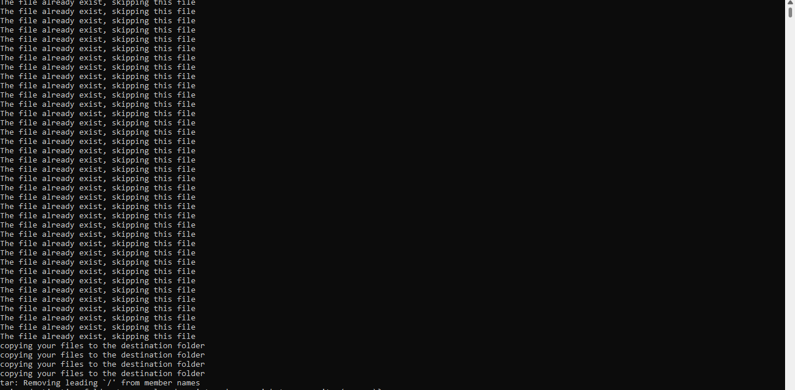

# File_Checker Script

## Welcome to my file checker program!

This program was designed to help you keep your files organized and up-to-date. Here's how it works: first, you specify two folders - the "source" folder and the "destination" folder. Then, the program will scan both folders and compare the contents. Suppose any files or directories in the source folder are newer than the corresponding items in the destination folder. In that case, those items will be copied over. Otherwise, the program will skip them.
After that, the destination folder is compressed and archived. 



## Prerequisite
1) Have bash script installed on your local machine

2) Ensure both the source directory and destination directory exist on your local machine.

## How to Use This Repo

) fork the repo and clone it onto your local machine. 

2) Navigate to the project directory

3) run the script by entering the command below into your terminal. 
```
bash File_Checker_Program.sh
```
4)Finally, enter both the source and destination folder when prompted. 

An example of a source folder could be: /home/omisore76/folder1


Thank you!


